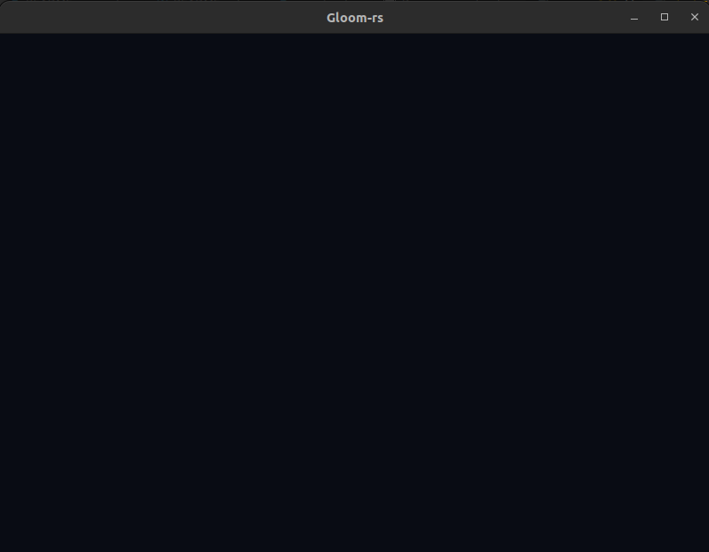

---
# This is a YAML preamble, defining pandoc meta-variables.
# Reference: https://pandoc.org/MANUAL.html#variables
# Change them as you see fit.
title: TDT4195 Exercise 1
author:
- Kacper Krzysztof Maciejko
- Clément Jourdin
date: \today # This is a latex command, ignored for HTML output
lang: en-US
papersize: a4
geometry: margin=4cm
toc: false
toc-title: "Table of Contents"
toc-depth: 2
numbersections: true
header-includes:
# The `atkinson` font, requires 'texlive-fontsextra' on arch or the 'atkinson' CTAN package
# Uncomment this line to enable:
#- '`\usepackage[sfdefault]{atkinson}`{=latex}'
colorlinks: true
links-as-notes: true
# The document is following this break is written using "Markdown" syntax
---

<!--
This is a HTML-style comment, not visible in the final PDF.
-->

# Tasl 1: Drawing your first triangle

## (c) 
Define and instantiate a VAO containing at least 5 distinct triangles using the function you defined in (a). Use the shader pair you loaded in (b) to
draw the VAO elements.

```rust
let vertices_vec_4: Vec<f32> = vec![
    -0.6, -0.6, 0.0, 1.0, 1.0, 1.0,
    0.6, -0.6, 0.0, 1.0, 1.0, 1.0,
    0.0,  0.6, 0.0, 1.0, 1.0, 1.0,

    -0.6, 0.6, 0.0, 1.0, 1.0, 1.0,
    0.6, 0.6, 0.0, 1.0, 1.0, 1.0,
    0.0, 0.9, 0.0, 1.0, 1.0, 1.0,

    -0.8, -0.8, 0.0, 1.0, 0.0, 0.0,
    -0.4, -0.8, 0.0, 1.0, 0.0, 0.0,
    -0.6, -0.65, 0.0, 1.0, 0.0, 0.0,

    -0.5, 0.4, 0.0, 1.0, 1.0, 1.0,
    0.5, 0.4, 0.0, 1.0, 1.0, 1.0,
];

// adding more triangles, we also have to add more indices (3 for each)
let indices_vec_4: Vec<u32> = vec![
    0, 1, 2,
    3, 4, 5,
    6, 7, 8,
    0, 9, 3,
    1, 10, 2,
    ];
```


## Task 2: Geometry and Theory

### a)


The triangle is truncated on 2 sides because 2 of its vertices have a coordinate which is outside of the coordinate system we are working on (vertices 0 and 2 have respectively -1.2 and 1.2 as their z coordinate, and the coordinate system ranges from -1 to 1). This phenomenon is called **clipping** and it ensures that images behind the camera are not visible in the rendered image.

### b)
```rust
let vertices2_vec_4: Vec<f32> =
    vec![
        0.6, -0.8, -1.2, 0.0, 0.0, 1.0,
        0.0, 0.4, 0.0, 0.0, 0.0, 1.0,
        -0.8, -0.2, 1.2, 0.0, 0.0, 1.0,
    ];

let indices2_vec_4: Vec<u32> = vec![
    0, 2, 1,
    ];
```



When we put the vertices clockwise instead of counterclockwise in the index buffer, no triangle is displayed on the screen. This can be explained by the fact that the ```gl::DrawElements``` function supplies the points in counter-clockwise order. Therefore, if the points we give to it are in a clockwise order, the back face of the triangle is rendered on the screen.

### c) Geometry and Theory
1. Why does the depth buffer need to be reset each frame? Describe what you would observe in a scene with a sphere moving rightward, while not clearing the depth buffer:
The depth buffer holds the depth of each pixel in the scene. Each fragment is compared against the depth buffer's value at that point. If a scene changes, but the depth buffer is not cleared, the pixels in a new scene will be compared against the depth values of the previous frame. That means that a sphere moving rightward would leave a trail of hidden background pixels in its wake, because their depth would still be registering as being hidden behind an object - even if said object has since moved.

2. In which situation can the Fragment Shader be executed multiple times for the same pixel?
The Fragment Shader can be executed multiple times for the same pixel when several points share the same x and y coordinates but don't have the same depth (z coordinate). Only the point that is most on top of the scene (has the bigger z coordinate) will be shown on the finale scene, but the Fragment Shader is still called for every point.

3. What are the two most commonly used types of shaders? What are the responsibilites of each of them?
* Vertex Shader - shader responsible for transforming individual vertices around a scene, as well as projecting the scene onto the camera.
* Fragment Shader - shader responsible for determining the colour of each fragment

4. Why is it common to use an index buffer to specify which vertices should be connected into triangles, as opposed to relying on the order in which the vertices are specified in the vertex buffer(s)?
The practice comes from the fact that vertices can be used multiple times over different triangles. Using an index buffer enables us to define the vertices once, and combining them together by using their index in the VBO. This can save memory usage, if executed correctly.


5. While the last output of gl::VertexAttribPointer() is a pointer, we usually pass it in a null pointer. Describe a situation in which you would pass a non-zero value into this function.
Using multiple entry types (for example passing a color of vertex alongside its position) would cause passing a non-zero value into this function. This is shown in the example below.
```rust
    gl::VertexAttribPointer(
        1,
        3,
        gl::FLOAT,
        gl::FALSE,
        (6 * size_of::<f32>()) as gl::types::GLint,
        (3 * size_of::<f32>()) as *const gl::types::GLvoid,
    );
```


# Optional Bonus Challenges
