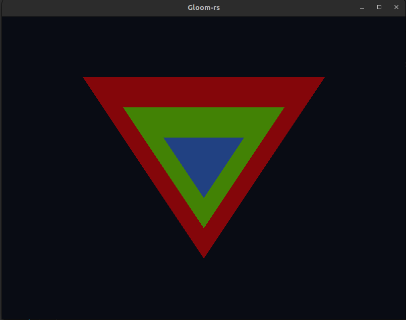
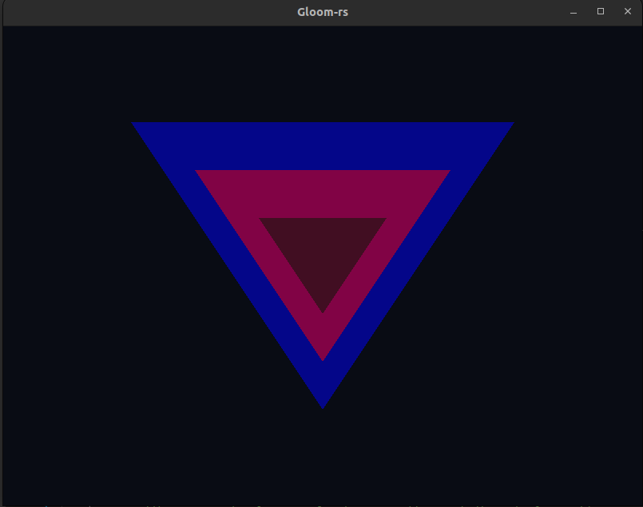
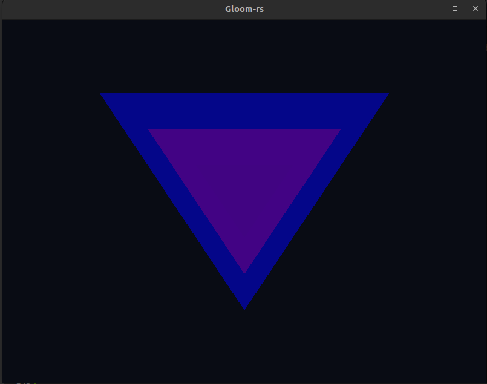

---
# This is a YAML preamble, defining pandoc meta-variables.
# Reference: https://pandoc.org/MANUAL.html#variables
# Change them as you see fit.
title: TDT4195 Exercise 2
author:
- Kacper Krzysztof Maciejko
- Clément Jourdin
date: \today # This is a latex command, ignored for HTML output
lang: en-US
papersize: a4
geometry: margin=4cm
toc: false
toc-title: "Table of Contents"
toc-depth: 2
numbersections: true
header-includes:
# The `atkinson` font, requires 'texlive-fontsextra' on arch or the 'atkinson' CTAN package
# Uncomment this line to enable:
#- '`\usepackage[sfdefault]{atkinson}`{=latex}'
colorlinks: true
links-as-notes: true
# The document is following this break is written using "Markdown" syntax
---

<!--
This is a HTML-style comment, not visible in the final PDF.
-->

# Task 1: Per-Vertex Colors

## (a) 


# Task 2: Alpha Blending and Depth

## (a)
```rust
// Triangles for Assignment 2 Task 2
        let vertices3_vec_4: Vec<f32> = vec![
            -0.6, -0.6, 0.9, 1.0, 0.0, 0.0, 0.5,
            0.6, -0.6, 0.9, 1.0, 0.0, 0.0, 0.5,
            0.0,  0.6, 0.9, 1.0, 0.0, 0.0, 0.5,

            -0.4, -0.4, 0.5, 0.0, 1.0, 0.0, 0.5,
            0.4, -0.4, 0.5, 0.0, 1.0, 0.0, 0.5,
            0.0, 0.4, 0.5, 0.0, 1.0, 0.0, 0.5,

            -0.2, -0.2, 0.0, 0.0, 0.0, 1.0, 0.5,
            0.2, -0.2, 0.0, 0.0, 0.0, 1.0, 0.5,
            0.0, 0.2, 0.0, 0.0, 0.0, 1.0, 0.5,
        ];

        // adding more triangles, we also have to add more indices (3 for each)
        let indices3_vec_4: Vec<u32> = vec![
            0, 1, 2,
            3, 4, 5,
            6, 7, 8,
            ];


        let my_vao3 = unsafe { create_vao(&vertices3_vec_4, &indices3_vec_4) };

```



## (b)
### (i)
```rust
// Triangles for Assignment 2 Task 2
        let vertices3_vec_4: Vec<f32> = vec![
            -0.6, -0.6, 0.9, 0.0, 0.0, 1.0, 0.5,
            0.6, -0.6, 0.9, 0.0, 0.0, 1.0, 0.5,
            0.0,  0.6, 0.9, 0.0, 0.0, 1.0, 0.5,

            -0.4, -0.4, 0.5, 1.0, 0.0, 0.0, 0.5,
            0.4, -0.4, 0.5, 1.0, 0.0, 0.0, 0.5,
            0.0, 0.4, 0.5, 1.0, 0.0, 0.0, 0.5,

            -0.2, -0.2, 0.0, 0.0, 0.1, 0.0, 0.5,
            0.2, -0.2, 0.0, 0.0, 0.1, 0.0, 0.5,
            0.0, 0.2, 0.0, 0.0, 0.1, 0.0, 0.5,
        ];

        // adding more triangles, we also have to add more indices (3 for each)
        let indices3_vec_4: Vec<u32> = vec![
            0, 1, 2,
            3, 4, 5,
            6, 7, 8,
            ];


        let my_vao3 = unsafe { create_vao(&vertices3_vec_4, &indices3_vec_4) };

```



When swapping the colors of the three triangles, the color of the area in which the triangles overlap changes as well.
This can be explained by the following equation: \
Color_New = Color_Source · Alpha_Source + Color_Destination · (1 − Alpha_Source ) \
Let's apply this equation to a pixel in the overlapping area in both cases and witness the difference.
In the first case (question (a)), we have:
- When the first (red) triangle is drawn: Color_New = 0.5\*red + 1\*black
- When the second (green) triangle is drawn: Color_New = 0.5\*green + 0.5\*(0.5\*red + 1\*black) = 0.5\*green + 0.25\*red + 0.5\*black
- When the last (blue) triangle is drawn: Color_New = 0.5\*blue + 0.5\*(0.5\*green + 0.25\*red + 0.5\*black) = 0.5\*blue + 0.25\*green + 0.125\*red + 0.25\*black

Whereas in the second case (question (b)), we have:
- When the first (blue) triangle is drawn: Color_New = 0.5\*blue + 1\*black
- When the second (red) triangle is drawn: Color_New = 0.5\*red + 0.5\*(0.5\*blue + 1\*black) = 0.5\*red + 0.25\*blue + 0.5\*black
- When the last (green) triangle is drawn: Color_New = 0.5\*green + 0.5\*(0.5\*red + 0.25\*blue + 0.5\*black) = 0.5\*green + 0.25\*red + 0.125\*blue + 0.25\*black

0.5\*blue + 0.25\*green + 0.125\*red + 0.25\*black != 0.5\*green + 0.25\*red + 0.125\*blue + 0.25\*black, therefore the overlapping area appears in a different color in each case.

### (ii)
```rust
// Triangles for Assignment 2 Task 2
        let vertices3_vec_4: Vec<f32> = vec![
            -0.6, -0.6, 0.0, 0.0, 0.0, 1.0, 0.5,
            0.6, -0.6, 0.0, 0.0, 0.0, 1.0, 0.5,
            0.0,  0.6, 0.0, 0.0, 0.0, 1.0, 0.5,

            -0.4, -0.4, 0.5, 1.0, 0.0, 0.0, 0.5,
            0.4, -0.4, 0.5, 1.0, 0.0, 0.0, 0.5,
            0.0, 0.4, 0.5, 1.0, 0.0, 0.0, 0.5,

            -0.2, -0.2, 0.9, 0.0, 0.1, 0.0, 0.5,
            0.2, -0.2, 0.9, 0.0, 0.1, 0.0, 0.5,
            0.0, 0.2, 0.9, 0.0, 0.1, 0.0, 0.5,
        ];

        // adding more triangles, we also have to add more indices (3 for each)
        let indices3_vec_4: Vec<u32> = vec![
            6, 7, 8,
            3, 4, 5,
            0, 1, 2,
            ];


        let my_vao3 = unsafe { create_vao(&vertices3_vec_4, &indices3_vec_4) };


```



When swapping the z-coordinate of the three triangles, the color of the area in which the triangles overlap changes.
We notice that the furthest a triangle is, the less is color impacts the color of the overlapping area. In the example given in the screenshot, the triangle with the biggest z-coordinate (ie the furthest one) is the green one, and green is also the less prominent color in the overlapping area.
Those observations make sense as we can expect to see object that are close to the "camera" better than the ones that are far from it.


# Task 3: The Affine Transformation Matrix

## (a)