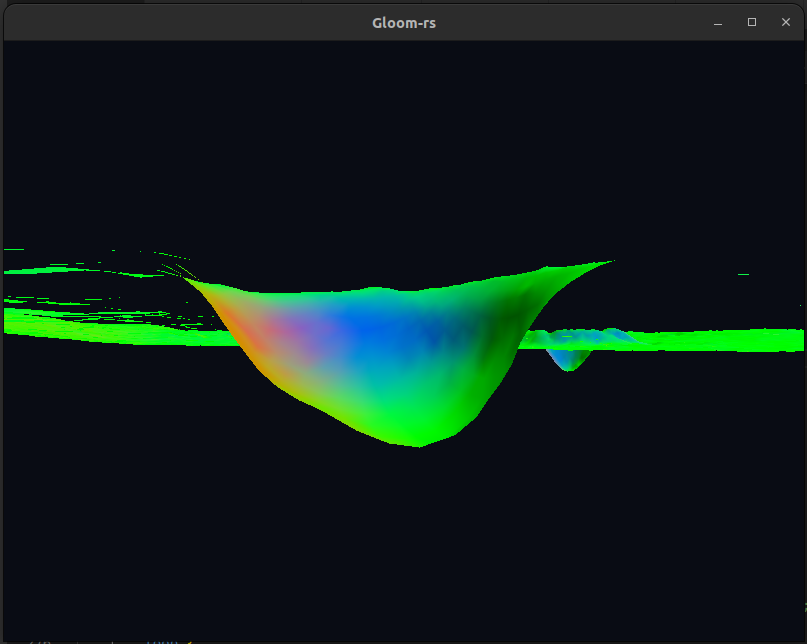
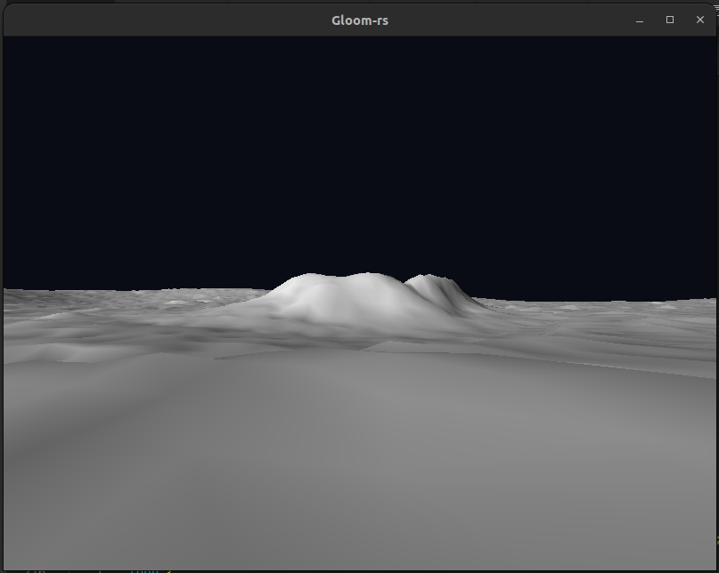
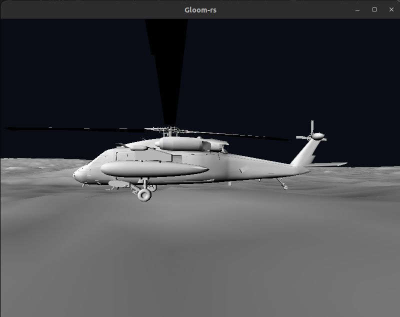

---
# This is a YAML preamble, defining pandoc meta-variables.
# Reference: https://pandoc.org/MANUAL.html#variables
# Change them as you see fit.
title: TDT4195 Exercise 3
author:
- Kacper Krzysztof Maciejko
- Clément Jourdin
date: \today # This is a latex command, ignored for HTML output
lang: en-US
papersize: a4
geometry: margin=4cm
toc: false
toc-title: "Table of Contents"
toc-depth: 2
numbersections: true
header-includes:
# The `atkinson` font, requires 'texlive-fontsextra' on arch or the 'atkinson' CTAN package
# Uncomment this line to enable:
#- '`\usepackage[sfdefault]{atkinson}`{=latex}'
colorlinks: true
links-as-notes: true
# The document is following this break is written using "Markdown" syntax
---

<!--
This is a HTML-style comment, not visible in the final PDF.
-->

# Task 1: More plygons than you can shake a stick at

## (c) 


The camera coordinates to achieve this:
```rust
let mut cameraX = 250.0;
let mut cameraY = 0.0;
let mut cameraZ = -500.0;
let mut angleX = 0.0;
let mut angleY = 0.0;
```

## (d) 



# Task 2: Helicopter Parenting

## (c) 


draw_scene function to achieve this:
```rust
unsafe fn draw_scene(node: &scene_graph::SceneNode,
    view_projection_matrix: &glm::Mat4,
    transformation_so_far: &glm::Mat4,
    shader: &shader::Shader)
{
    // logic before drawing the node
    
    // check if node drawable, set uniforms, bind vao, draw vao
    if node.index_count != -1 {
        let loc = shader.get_uniform_location("camera_transformation_matrix");
        gl::UniformMatrix4fv(loc, 1, gl::FALSE, view_projection_matrix.as_ptr());

        gl::BindVertexArray(node.vao_id);

        gl::DrawElements(
            gl::TRIANGLES,
            node.index_count as i32,
            gl::UNSIGNED_INT,
            ptr::null(),
        );
    }

    // Recurse
    for child in &node.children {
        draw_scene(&**child, view_projection_matrix, transformation_so_far, &shader);
    }
}
```


# Task 5: Help! My lighting is wrong!

## (a) 
M

## (c) 
M


# Task 6: Time to turn this thing up to ~~11~~ 5

## (a) 
M
